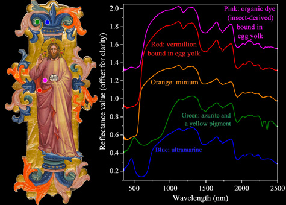

Objectives

Develop a comprehensive protocol for the non-invasive analysis of artists' materials and techniques.  
Examine large and representative groups of illuminated manuscripts.  
Interpret the scientific results within a broad scientific, cultural and historical framework.  
Share these with international academic audiences and the wider public via publications, the MINIARE web portal including an interactive research resource and a major exhibition to be held at the Fitzwilliam Museum in 2016.

 Pigment analysis with a fibre optics spectroradiometer of an illuminated manuscript cutting: Fitzwilliam Museum, Marlay cutting It. 13.ii, Florence, c.1409. The spectral characteristics allow identification of most of the pigments used and of some paint binders.