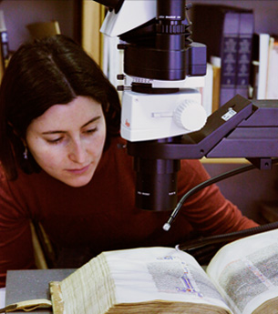

About Us

### The Project Team

Dr Stella Panayotova _Keeper of Manuscripts and Printed Books, Fitzwilliam Museum_

Professor Stephen Elliott _Chemical Physics Group, Department of Chemistry_

Dr Spike Bucklow _Research Scientist, Hamilton Kerr Institute_

Edward Cheese _Conservator of Manuscripts and Printed Books, Fitzwilliam Museum_

Dr Paola Ricciardi _Research Scientist, Fitzwilliam Museum_

Dr Deirdre Jackson _Art Historian, Department of Manuscripts and Printed Books, Fitzwilliam Museum_

### Cambridge research network

Dr Pietro Cicuta _University Lecturer, Department of Physics_

Dr Sachiko Kusuwaka _Affiliated Lecturer, Department of the History and Philosophy of Science_

Dr Nigel Morgan _Emeritus Professor, Department of History of Art_

Georgina Doji _Computer Associate, Fitzwilliam Museum_

Dr Carola-Bibiane Schönlieb _University Lecturer, Department of Applied Mathematics and Theoretical Physics_

### International research network

Victoria & Albert Museum, London _Dr Lucia Burgio, Senior Object Analysis Scientist_

Durham University _Prof Richard Gameson, Department of History  
Prof Andrew Beeby, Department of Chemistry_

Getty Conservation Institute, Los Angeles _Dr Karen Trentelman, Senior Scientist_

J. Paul Getty Museum, Los Angeles _Nancy Turner, Manuscripts Conservator_

ICIS-CNR, Padova _Dr Luca Nodari, Researcher_

National Gallery of Art, Washington DC _Dr John Delaney, Senior Imaging Scientist  
Dr Kathryn Dooley, Postdoctoral Research Fellow  
Michelle Facini, Paper Conservator_

Nottingham Trent University _Dr Haida Liang, Imaging Science for Archaeology & Art Conservation research group_

University of Antwerp _Prof Koen Janssens, Department of Chemistry  
Stijn Legrand, Department of Chemistry_