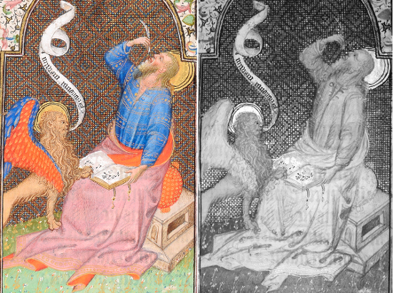

Publications

P. Ricciardi and S. Panayotova, 'A holistic, noninvasive approach to the technical study of manuscripts. The case of the Breslau Psalter', in [The noninvasive analysis of painted surfaces: scientific impact and conservation practice](http://opensi.si.edu/index.php/smithsonian/catalog/book/105), eds. A. Nevin and T. Doherty, Washington DC: Smithsonian Institution Scholarly Press, 2016, 25-36

P. Ricciardi and A. Pallipurath, ['The five colours of art: non-invasive analysis of pigments in Tibetan prints and manuscripts'](http://booksandjournals.brillonline.com/content/books/9789004316256), in Tibetan Printing: Comparison, Continuities and Change, eds. H. Diemberger, F.-K. Ehrhard and P. Kornicki, Leiden and Boston: Brill, 2016, 485-500

S. Panayotova (ed.), [COLOUR: The Art and Science of Illuminated Manuscripts](http://www.fitzmuseum.cam.ac.uk/colour/catalogue), Harvey Miller Publishers/Brepols, 2016

A. R. Pallipurath, J. M. Skelton, P. Ricciardi, S. R. Elliott, 'Estimation of semiconductor-like pigment concentrations in paint mixtures and their differentiation from paint layers using first-derivative reflectance spectra', _Talanta_ 154 (2016), 63-72, [dx.doi.org/10.1016/j.talanta.2016.03.052](http://dx.doi.org/10.1016/j.talanta.2016.03.052)

P. Ricciardi, S. Legrand, G. Bertolotti, K. Janssens, 'Macro X-ray fluorescence (MA-XRF) scanning of illuminated manuscript fragments: potentialities and challenges', _Microchemical Journa_l 124 (2016), 785-791, [dx.doi.org/10.1016/j.microc.2015.10.020](http://dx.doi.org/10.1016/j.microc.2015.10.020)

C. Anselmi, P. Ricciardi, D. Buti, A. Romani, P. Moretti, K. Rose Beers, B. G. Brunetti, C. Miliani, A. Sgamellotti, 'MOLAB® meets Persia: non-invasive study of a sixteenth-century illuminated manuscript', _Studies in Conservation_ 60/S1 (2015), S185-S192, [dx.doi.org/10.1179/0039363015Z.000000000223](http://dx.doi.org/10.1179/0039363015Z.000000000223)

A. Pallipurath, R. Villő Vőfély, J. Skelton, P. Ricciardi, S. Bucklow, and S. Elliott, 'Estimating the concentrations of pigments and binders in lead-based paints using FT-Raman spectroscopy and principal component analysis', _Journal of Raman Spectroscopy_ 45 (2014), 1272-1278, [dx.doi.org/10.1002/jrs.4525](http://dx.doi.org/10.1002/jrs.4525)

K. Rose and P. Ricciardi, 'Fusing Findings: a cross-disciplinary approach to material analysis of Manuscripts at the Fitzwilliam Museum, Cambridge'. In: _Uluslararasi Cilt Sanati Bulusmasi Sempozyumu_, Lale Publishing, Istanbul, 2014, 92- 9

P. Ricciardi and A. Pallipurath, '[Colours](documents/Ricciardi_Pallipurath_Buddha's Word_2014.pdf)', in _Buddha's Word: The Life of Books in Tibet and Beyond_, eds. M. Elliott, H. Diemberger and M. Clemente, Cambridge: Museum of Archaeology and Anthropology, 2014

S. Panayotova, 'The Rohan Masters: Collaboration and Experimentation in the Hours of Isabella Stuart', in _Manuscripta Illuminata: Approaches to Understanding Medieval and Renaissance Manuscripts_, ed. C. Hourihane, Princeton: Index of Christian Art, 2014

P. Ricciardi, A. Pallipurath and K. Rose, 'It's not easy being green': a spectroscopic study of green pigments used in illuminated manuscripts, _Analytical Methods_ **5** (2013), 3819-3824, [dx.doi.org/10.1039/C3AY40530C](http://dx.doi.org/10.1039/C3AY40530C)

A. Pallipurath, J. Skelton, P. Ricciardi, S. Bucklow and S. Elliott, 'Multivariate analysis of combined Raman and fibre-optic reflectance spectra for the identification of binder materials in simulated medieval paints', _Journal of Raman Spectroscopy_ **44** (2013), 866-874, [dx.doi.org/10.1002/jrs.4291](http://dx.doi.org/10.1002/jrs.4291)

Fitzwilliam Museum, MS 62, fol. 18v, Northern France, c.1430.  
Left: visible image. Right: infrared image showing underdrawing