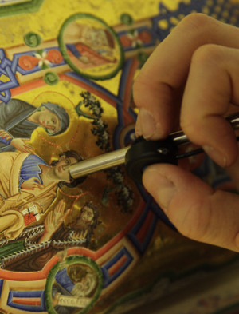

Support Us

The systematic analysis of manuscript illumination is a complex and costly enterprise. In October 2011, MINIARE began as 
a two-year pilot project, focusing on the pigment analysis of Western manuscripts, with the support of a private donor, 
the Newton Trust, and Cambridge University. To achieve its long-term objectives and international impact MINIARE requires 
substantial resources. If you share our vision and are interested in supporting our activities, contact us at 
[info](mailto:info@miniare.org).

**Current Supporters:** The Fitzwilliam Museum's Paul Mellon Fund

**Previous Supporters:** Isaac Newton Trust, University of Cambridge Fund for Cross-Disciplinary Research, ICOM UK Travel Bursary Fund, Designation Development Fund (Arts Council England), Esmée Fairbairn Collections Fund (Museums Association), Pilgrim Trust, Zeno Karl Schindler Foundation, Returning Carers Scheme (University of Cambridge), the British Academy’s Neil Ker Memorial Fund

**Corporate Supporters:** Analytik Ltd., Bruker Elemental, Photonic Science Ltd., Pixelteq