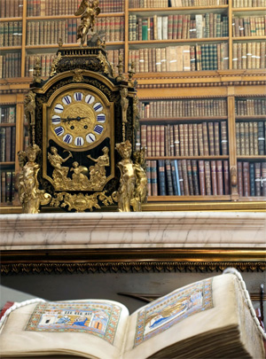

Why Cambridge?

Few places in the world combine rich and diverse manuscript collections with access to sophisticated equipment and 
multidisciplinary expertise. The Fitzwilliam Museum, Cambridge University Library and the Colleges preserve one of the 
largest and finest collections of European medieval and Renaissance manuscripts as well as important African and Asian 
material, representing the history of manuscript production across three continents over four millennia (1350 BC-19th c. AD). 
Additionally, Cambridge has an extraordinary concentration of leading scholars working in the arts, social sciences and 
humanities, as well as some of the world's finest conservators and scientists. Cambridge University's Departments of 
Chemistry and Physics are among the leaders world-wide. Existing collaborations between scholars in these diverse fields 
have laid the foundation of the sciences-humanities-arts synergy indispensible for MINIARE.